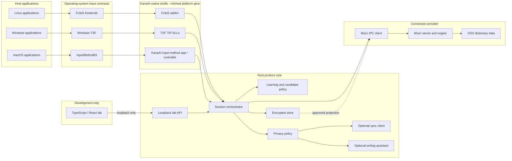
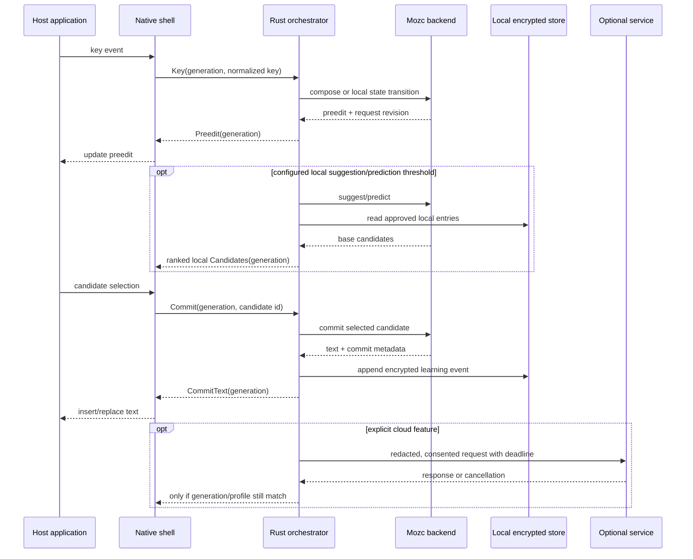
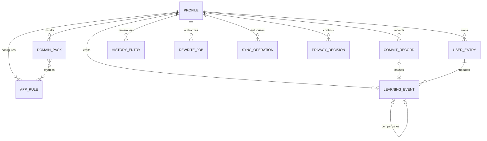

# KanaAI architecture

**Status:** normative target architecture
**Research access date for external documentation:** 2026-09-24

KanaAI is a local-first Japanese language runtime embedded in an IME. It is not an ATOK clone and not a chat assistant attached to a converter. This document defines the product boundaries, data model, data flow, latency strategy, and privacy boundaries. The current repository implements the core, Mozc bridge, API, and development workbench; native shells and production persistence remain roadmap work.

## Product boundary: IME, not chatbot

KanaAI's user-visible experience is the ordinary keyboard loop. The local model is not asked to generate every keystroke or to become a free-form writing partner. Mozc produces a valid candidate set first; KanaAI adds a fast semantic policy and, when useful, a structured local-LLM decision. The detailed AI task contract is in [`PRODUCT.md`](PRODUCT.md), and the runtime model ladder is in [`LOCAL_AI.md`](LOCAL_AI.md).

```text
key → mode/preedit FSM → Mozc candidates → fast ranker → optional local LLM
     → bounded candidate window → explicit commit → local learning
```

This separation is deliberate: an LLM is good at ambiguity and intent, while an IME needs deterministic composition, predictable modes, immediate commits, and recovery after crashes. A model failure may change an optional ranking, but it may not make the keyboard unusable.

## Architectural goals

1. **Correct Japanese conversion first.** Mozc supplies the composition, conversion, rewriting, and segmentation foundation.
2. **Sub-millisecond-sensitive work stays local.** Network prediction, sync, telemetry, and generative writing never block a key event or commit.
3. **Rust owns product orchestration.** Session state, policy, learning, storage, cancellation, and native-service contracts live in Rust.
4. **Native shells are thin.** Fcitx5, TSF, and InputMethodKit require platform language glue, but that glue may not become a second IME implementation.
5. **TypeScript is a laboratory instrument.** It may visualize and drive a local, loopback-only lab API; it is not an IME runtime or production dependency.
6. **Local intelligence is a bounded second stage.** Fast neural ranking may run in the candidate path; generative local AI runs only for ambiguity, repair, or an explicit action, and always has a deterministic fallback.
7. **The AI explains and proposes, never owns input state.** It cannot switch input modes, commit text, or silently rewrite accepted content.
8. **Every sensitive action is visible.** Context capture, learning, cloud requests, sync, and generation are separate consent decisions.

## Why these technologies

### Why Mozc is the conversion foundation

Mozc already exposes a broad, exercised Japanese IME core: interactive kana composition, conversion and reverse conversion, segmented candidates, transliteration, rewriters, user-dictionary lookup, and suggestion/prediction state. Its public C++ interfaces show `Composer` producing preedit/conversion/prediction queries, `Converter` composing immutable conversion, prediction, and rewriter modules, and `EngineConverter` owning stateful composition/suggestion/prediction/conversion transitions ([Mozc `composer.h`](https://github.com/google/mozc/blob/master/src/composer/composer.h), [`converter.h`](https://github.com/google/mozc/blob/master/src/converter/converter.h), and [`engine_converter_interface.h`](https://github.com/google/mozc/blob/master/src/engine/engine_converter_interface.h), all accessed 2026-09-24).

Rebuilding those pieces would put KanaAI's effort into dictionary generation, Japanese rewrite coverage, edge cases, regression corpora, and platform compatibility rather than its differentiating orchestration and privacy work. Mozc is the **conversion foundation**, not KanaAI's whole product:

- KanaAI does not reimplement or infer Google Japanese Input's proprietary data or internals.
- KanaAI supplies its own policy, canonical data model, user/domain ranking, correction UX, protection controls, sync, and optional writing workflow.
- Mozc is pinned and tested as an upstream component. Its README says there is no stable release, so a moving branch is not an acceptable dependency ([Mozc README](https://github.com/google/mozc), accessed 2026-09-24).

### Why Rust owns orchestration and native-adapter boundaries

Rust provides one typed command/state model across Linux, Windows, and macOS and concentrates unavoidable `unsafe` FFI in small, reviewable shims. Ownership types also make session teardown, cancellation, and cross-thread data transfer explicit. This does not make the inherited C++ engine memory-safe, nor does it eliminate unsafe platform COM/Objective-C calls; the benefit is that KanaAI-owned orchestration is outside those FFI islands.

Rust is responsible for:

- session state machines and request correlation;
- routing native commands to a conversion backend;
- local ranking and learning policy;
- encrypted persistence and deletion;
- process supervision and health;
- privacy decisions and redaction;
- optional network clients, timeouts, and cancellation; and
- the stable contracts consumed by thin native shells and the lab.

The operating-system APIs still require a small amount of C++/Objective-C++:

- Fcitx5's public engine API is C++ and its normal add-on is a shared library.
- TSF is COM and TSF loads an IME DLL into the client's process.
- InputMethodKit creates `IMKServer` and per-session `IMKInputController` objects.

Those shells translate ABI events and render UI. They do not parse Japanese, rank candidates, persist learning, or call a network service directly ([Fcitx5 developer guide](https://fcitx-im.org/wiki/Develop_an_simple_input_method), [Microsoft TSF](https://learn.microsoft.com/en-us/windows/win32/tsf/text-services-framework), and [Apple `IMKInputController`](https://developer.apple.com/documentation/inputmethodkit/imkinputcontroller), all accessed 2026-09-24).

### Why TypeScript is only the lab UI

An IME must synchronously participate in native event loops, maintain per-application sessions, expose preedit/candidate state, and load inside OS input frameworks. A browser or Node event loop does not satisfy those contracts. TypeScript remains valuable for a fast conversion workbench, inspection tools, dictionary editors, and controlled generative-writing experiments.

The dependency rule is strict:

```text
production Fcitx5 / TSF / InputMethodKit -> Rust core -> Mozc backend
TypeScript lab UI -> loopback lab API -> Rust core in lab/simulation mode
```

There is no production arrow from TypeScript to native adapters, Mozc, user storage, or network providers. A lab build may not be installed by the native packages.

## Performance and language strategy

Rust is the primary optimization language for KanaAI-owned code. The first
performance work is not a rewrite of Mozc's C++ conversion core; it is to make
the integration cheaper and more predictable:

- keep the TSF/DLL boundary in C++/COM where Windows requires it;
- use Rust for the broker, session/generation state, cancellation, candidate
  validation, bounded reranking, learning policy, caches, and process supervision;
- profile the existing Mozc IPC path before changing its protocol;
- use release builds, allocation limits, bounded queues, and backpressure at
  the key-to-candidate boundary; and
- add SIMD, caching, or in-process FFI only where a measured benchmark justifies
  the added ABI and review cost.

Other emerging languages may be used for isolated offline tools when they
provide a clear advantage, but language diversity is not a goal by itself. A
small Zig or C++ utility is acceptable only if it has a narrow build/test
contract; production session and AI orchestration stays in Rust.

Every optimization must publish before/after measurements for p50 and p95
keystroke-to-candidate latency, allocation count, CPU time, memory, model
latency, and fallback rate. A faster microbenchmark that worsens TSF stability
or Mozc correctness is rejected.

## Component topology



The first production backend uses a per-user `mozc_server` and its one-shot IPC command protocol. Mozc's own IPC design explicitly calls out that IPC occurs for every key event, requires a private per-user endpoint, and can damage responsiveness when slow ([Mozc IPC design](https://github.com/google/mozc/blob/master/docs/design_doc/mozc_ipc.md), accessed 2026-09-24). An in-process C ABI bridge is an optimization to investigate only after conformance and performance tests; it is not assumed to be a stable upstream API.

## Exact layer boundaries

| Layer | Owns | May depend on | Must not do |
|---|---|---|---|
| L0 — Host/input framework | Delivers key, focus, edit, and commit callbacks. | Platform APIs. | Know KanaAI policy or user data. |
| L1 — Native shell | Key translation, preedit/candidate presentation, owned/native windows, accessibility, ABI lifecycle, IPC to Rust. | L0 and the versioned KanaAI shell protocol. | Rank, learn, persist user text, inspect document text, make HTTP calls, or embed a generative client. |
| L2 — Rust orchestrator | Session FSM, command routing, deadlines, cancellation, profile selection, backend selection, and normalized results. | L3–L5 through traits. | Depend on Fcitx, Win32, Cocoa, DOM, React, Node, or a specific database file layout. |
| L3 — Mozc adapter | Translate one KanaAI session to Mozc commands; map candidates/preedit/context; isolate upstream protocol changes. | Pinned Mozc build and L2 traits. | Implement KanaAI policy, sync, network calls, or UI; write directly to Mozc's private databases. |
| L4 — Local data/policy | Canonical encrypted profile, learning events, user/domain entries, history, tombstones, protection state, audit metadata. | Storage and key-provider interfaces. | Initiate sync or AI requests; log content. |
| L5 — Optional services | Cloud prediction, encrypted sync, and explicit writing jobs. | Redacted L4 request objects and approved providers. | Run on the key path, write learning implicitly, or broaden payloads after consent. |
| L6 — Lab | Synthetic/replay controls, candidate inspection, dictionary tests, privacy-safe diagnostics. | Loopback versioned lab API. | Ship in an IME package, receive unrestricted system events, or use production data/credentials by default. |

### Boundary invariants

- Only L1 may ask the OS to insert, replace, or delete text.
- Only L2 may advance a production session state machine.
- Only L3 may mention `mozc.commands` or other upstream Mozc protocol types.
- Only L4 may persist canonical KanaAI user state.
- Only L5 may use the network.
- No L3–L5 module may depend upward on L1.
- L6 may call only explicitly marked lab operations and cannot write production learning unless the user performs a reviewed import.
- A network response never mutates session state without a matching generation token and current profile.

## Runtime contracts

The shell protocol is small, versioned, and transport-neutral. Its conceptual messages are:

```rust
enum ShellCommand {
    CreateSession { shell_session: SessionId, field: FieldClass, locale: String },
    DestroySession { shell_session: SessionId },
    Key { shell_session: SessionId, generation: u64, key: NativeKey },
    Edit { shell_session: SessionId, generation: u64, edit: EditAction },
    SelectCandidate { shell_session: SessionId, generation: u64, id: CandidateId },
    Commit { shell_session: SessionId, generation: u64, candidate: CandidateId },
    SetMode { shell_session: SessionId, mode: InputMode },
    SetPrivacy { shell_session: SessionId, state: PrivacyState },
}

enum ShellEvent {
    Consumed { generation: u64 },
    Preedit { generation: u64, spans: Vec<PreeditSpan> },
    Candidates { generation: u64, page: CandidatePage },
    CommitText { generation: u64, text: String, replacement: ReplacementRange },
    HideUi { generation: u64 },
    Error { generation: u64, code: PublicErrorCode },
}
```

`generation` increases for every state-changing input. Results from an older generation are discarded. Text offsets are Unicode scalar indices, not UTF-8 byte offsets, at the KanaAI shell boundary. Native replacement ranges are resolved by L1; they are not guessed by L2.

The Mozc adapter uses a `ConversionProvider` trait with operations equivalent to `compose`, `convert`, `suggest`, `predict`, `commit`, `revert`, and `reset`. That trait returns normalized preedit/candidate DTOs. Mozc IDs are scoped to one request/generation and are never persisted as KanaAI IDs.

## Request and data flow



### Commit ordering

1. L1 receives the user's candidate action and increments generation.
2. L2 asks L3 for the exact commit result.
3. L2 emits `CommitText` to L1 immediately after local validation.
4. L1 inserts/replaces text in the host and reports success/failure.
5. L2 appends the learning event to a durable local queue. If the commit failed, it marks the event invalid rather than learning it.
6. Store, sync, cleanup, and optional cloud work run outside the commit deadline.

This prevents a slow disk or network from corrupting the visible text, while the queue makes learning durable and auditable.

## Learning and ranking

KanaAI never treats “shown” as “chosen.” A learning event is created only after a confirmed local commit, explicit candidate registration, explicit negative feedback, or a successful undo/deletion path.

Candidate ranking wraps rather than mutates Mozc's internal scores:

```text
final_display_order =
    stable_local_policy(
        mozc_base_order,
        bounded_user_affinity,
        bounded_domain_affinity,
        bounded_recent_affinity,
        field_and_privacy_constraints
    )
```

Rules:

- Mozc candidates retain a stable base order for the current generation.
- User and domain influences use bounded, configured boosts; neither can reorder an incompatible field.
- A source is recorded as `system`, `user`, `domain`, `history`, `cloud`, or `rewrite` and is available in diagnostics.
- No-learning, password, protected, and disabled-learning fields emit no learning event.
- Undo and delete create compensating/tombstone records.
- Candidate injection/ranking is an external KanaAI policy until equivalence tests justify a deeper Mozc integration.

The canonical store is KanaAI's, not Mozc's user dictionary file. The initial Mozc adapter may project approved entries through Mozc's import command in an isolated profile, but direct database parsing/editing is forbidden. Destructive changes require a verified rebuild or replacement projection. If that cannot provide deterministic deletion and acceptable latency, an in-process dictionary-provider bridge becomes a release gate rather than an undocumented workaround.

## Data model

All timestamps are UTC instants; all text is Unicode; encrypted payloads carry a schema version and nonce. IDs are opaque and stable only within their stated scope.

```text
Profile
  id, schema_version, display_name, default_locale
  learning_policy, cloud_policy, sync_policy, created_at, updated_at

UserEntry
  id, profile_id, reading, surface, pos_class?
  weight, positive_count, negative_count
  scope(global | app_class | domain_pack)
  source, created_at, updated_at, deleted_at?

DomainPack
  id, profile_id, name, version, enabled
  entry_count, content_digest, installed_at, removed_at?

AppRule
  id, profile_id, coarse_app_class
  enabled_packs, learning_policy, prediction_policy
  local_alias_hash?, never a required raw path/title

LearningEvent
  id, profile_id, session_epoch, generation, kind
  reading, committed_surface, candidate_source
  weight_delta, app_class?, domain_pack_ids[], created_at
  causal_commit_id, compensating_event_id?

CommitRecord
  id, profile_id, session_epoch, generation
  committed_text_or_entry_ref, char_count
  created_at, expires_at, learning_event_id?
  full_text_history_enabled

HistoryEntry
  id, profile_id, reading, surface
  previous_entry_id?, last_used_at, use_count
  sensitivity_class, expires_at?, deleted_at?

Candidate
  request_id, candidate_id, reading, surface
  base_rank, source, user_affinity?, domain_affinity?
  explanation_code?, learning_eligible

CorrectionIssue
  id, request_id, range, kind(typo | spelling | usage | style)
  original, suggestion, confidence, explanation_code, applied=false

RewriteJob
  id, profile_id, provider_id, purpose
  selected_range, instruction, style_summary_ref?
  disclosure_version, state, created_at, expires_at
  no default durable result history

SyncOperation
  id, device_id, entity_type, entity_id, schema_version
  lamport, mutation(tombstone | encrypted_payload), created_at

PrivacyDecision
  id, profile_id, feature, scope, decision
  reason_code, policy_version, changed_at
  no content field
```

### Entity relationships



### Ephemeral versus durable state

| State | Lifetime | Default persistence |
|---|---|---|
| Native key event and current preedit | One session/generation | Memory only; zeroized after release. |
| Mozc conversion response | One generation | Memory only. |
| Candidate request | Until superseded/cancelled | Memory only. |
| Learning event | Until merged, then aggregate + audit metadata | Encrypted local queue/store. |
| Commit record | Configurable short TTL | Encrypted local store only if history is enabled. |
| User/domain entry | Until user deletes it | Encrypted local store. |
| Correction issue | One request | Memory only. |
| Rewrite job/result | Explicit action session | Memory by default; provider terms disclosed. |
| Sync operation | Remote retention policy plus local tombstone horizon | Client-encrypted. |
| Privacy decision | Until changed | Local, non-content metadata. |

## Storage and key boundaries

- Canonical profile data is stored in an OS-appropriate user data directory with user-only permissions.
- Sensitive fields are envelope-encrypted with an authenticated construction and per-record nonces. A release must name and review the exact AEAD; this document does not prescribe an unimplemented cipher.
- Keys are held in the platform credential store when available. A plaintext key file is not an acceptable silent fallback; if secure storage is unavailable, sensitive learning is disabled until the user chooses a documented fallback.
- Mozc runs with an isolated KanaAI profile. KanaAI does not rely on Mozc's upstream user history for canonical data. Mozc's own design document says most local data is plain and some history is only obfuscated for casual-leak protection, with weaker key protection on Linux ([Mozc data-protection design](https://github.com/google/mozc/blob/master/docs/design_doc/data_protection.md), accessed 2026-09-24).
- Schema migrations are transactional and reversible. Export is versioned JSON/TSV plus a machine-readable manifest; import always previews profile, counts, conflicts, and sensitive fields.

## Latency and scheduling strategy

The following are **engineering budgets, not measured claims**. Release tests must publish percentiles by platform, CPU, power mode, dictionary, and composition length.

| Operation | Target | Deadline behavior |
|---|---:|---|
| Native event to Rust receipt | p95 ≤ 1 ms | A slow adapter is instrumented; never bypass policy. |
| Local preedit update | p95 ≤ 3 ms | Drop optional prediction/UI detail first. |
| Local conversion for a typical ≤30-character composition | p95 ≤ 15 ms | Return base Mozc candidates; omit optional features. |
| Commit dispatch to host | p95 ≤ 5 ms | Do not wait for disk, sync, or network. |
| First useful UI after process start | p95 ≤ 750 ms warm / ≤ 2 s cold | Show a direct-input/recovery mode if exceeded. |

Scheduling rules:

1. One ordered executor owns state transitions for a session.
2. Mozc IPC and any ranking work run on a bounded conversion pool.
3. Each request carries session epoch and generation; stale cloud or ranking results are dropped.
4. Optional features have feature-specific deadlines and cancellation tokens.
5. No network socket, filesystem traversal, or model request runs on the synchronous executor.
6. Persistent learning uses a bounded queue with coalescing and a durable low-water mark.
7. Adaptive quality may disable suggestions, then expensive re-ranking, but never basic composition/conversion.

## Privacy strategy in the architecture

- Full surrounding document text is off by default. L1 sends only field class, locale, mode, and the current composition. A bounded context excerpt is a separate opt-in field with a maximum length and visible setting.
- App identity is reduced locally to a user-defined coarse class. Raw executable paths, window titles, URLs, and document text do not enter the core contract.
- Password/secure fields disable history, cloud, correction, and learning at the first privacy check.
- Protect Mode hides previews/predictions and suspends learning; optional network work is cancelled.
- Local-only conversion is a release invariant. Cloud outages, account removal, or provider failure cannot block Japanese input.
- The TypeScript lab is loopback-only, uses synthetic data by default, and displays the exact request that a cloud/AI action would send.
- See [PRIVACY.md](PRIVACY.md) for the normative data inventory, consent, retention, deletion, sync, and threat model.

## Failure handling

| Failure | Required behavior |
|---|---|
| Mozc server exits | Restart once with backoff, preserve an immutable snapshot only if it contains no secret, then switch to direct input and show a non-blocking status. Never silently use a cloud fallback. |
| Conversion deadline | Return the last valid local result or base preedit; increment a content-free health counter. |
| Rust core unavailable | Native shell enters a documented safe direct-input mode and reconnects by session epoch. It must not implement a partial second engine. |
| Store unavailable | Continue conversion in memory, queue a bounded amount, clearly show degraded learning, never block commits. |
| Key-store unavailable | Disable sensitive persistence; explain before accepting a weaker mode. |
| Cloud timeout/offline | Complete local input normally; cancel stale jobs. |
| Sync conflict | Keep both versions, apply deterministic rules only for commutative counters, and require user review for semantic entries. |
| Mozc update changes output | Fail golden/conformance tests; do not “fix” the test fixture. |
| Native shell crash | Broker observes disconnect, destroys session state, and clears keys/compositions. |

## Architectural test gates

- **Protocol:** golden encode/decode and forward/backward compatibility tests.
- **State:** model-based session tests across key, selection, undo, focus loss, cancellation, and reconnect.
- **Conversion conformance:** license-clean Japanese fixtures checked against the pinned Mozc revision.
- **Privacy:** canary strings must never appear in logs, metrics, crash dumps, cloud packets, or TypeScript bundles.
- **Performance:** release-mode percentile benchmarks with CPU contention and cold dictionaries.
- **Security:** FFI bounds checks, IPC peer validation, fuzz parsers, signed update metadata, dependency/SBOM review.
- **Platform:** per-application focus/preedit/candidate tests under each OS contract.
- **Recovery:** kill/restart each process at every key-path boundary and verify no text duplication or cross-session state.

## Primary technical sources

All sources were accessed **2026-09-24**.

1. [Mozc repository and licensing summary](https://github.com/google/mozc)
2. [Mozc `Composer` interface](https://github.com/google/mozc/blob/master/src/composer/composer.h)
3. [Mozc `Converter` interface](https://github.com/google/mozc/blob/master/src/converter/converter.h)
4. [Mozc stateful `EngineConverterInterface`](https://github.com/google/mozc/blob/master/src/engine/engine_converter_interface.h)
5. [Mozc user dictionary interface](https://github.com/google/mozc/blob/master/src/dictionary/user_dictionary.h)
6. [Mozc user-history predictor interface](https://github.com/google/mozc/blob/master/src/prediction/user_history_predictor.h)
7. [Mozc IPC design](https://github.com/google/mozc/blob/master/docs/design_doc/mozc_ipc.md)
8. [Mozc data-protection design](https://github.com/google/mozc/blob/master/docs/design_doc/data_protection.md)
9. [Fcitx5 input-method developer guide](https://fcitx-im.org/wiki/Develop_an_simple_input_method)
10. [Microsoft Text Services Framework](https://learn.microsoft.com/en-us/windows/win32/tsf/text-services-framework)
11. [Microsoft custom IME requirements](https://learn.microsoft.com/en-us/windows/apps/develop/input/input-method-editor-requirements)
12. [Apple `IMKInputController`](https://developer.apple.com/documentation/inputmethodkit/imkinputcontroller)
