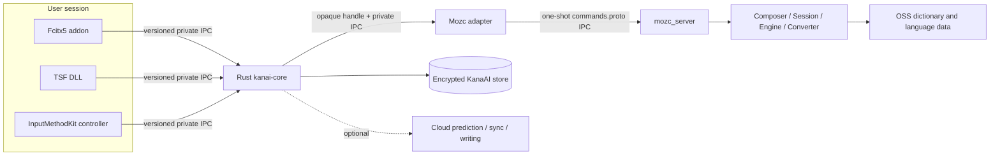
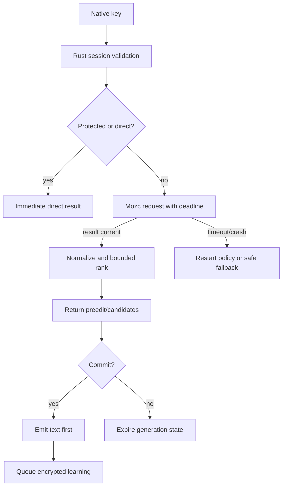

# KanaAI — Mozc integration

**Status:** normative integration contract
**Research access date:** 2026-09-24

KanaAI uses the open-source Mozc project as its deterministic Japanese input foundation. Mozc is the substrate that already handles kana composition, dictionaries, candidate generation, rewriters, and input-mode semantics; KanaAI's local AI is a bounded semantic layer above it. KanaAI does **not** use Google Japanese Input binaries, private dictionaries, internal corpora, ranking models, or any ATOK code/data/model. This document defines how to consume Mozc without leaking its implementation into KanaAI's product layers.

## Reviewed baseline

The `third_party/mozc` submodule was reviewed at commit [`13c98988247aa711d99db9e348ec2a597d14b5cd`](https://github.com/google/mozc/tree/13c98988247aa711d99db9e348ec2a597d14b5cd) (`3.34.6239-128-g13c989882`) on 2026-09-24. Production builds must use the exact gitlink recorded by the repository and Bazelisk version from the pinned submodule; this prose baseline is not a floating version selector.

Mozc states that its open-source project is a subset released without official Google support or a stable-release channel. Its Linux, Windows, macOS, and Android build documentation is current, but an update can still change internal APIs, data, output ordering, and behavior ([Mozc README](https://github.com/google/mozc), accessed 2026-09-24).

## Why Mozc is the right foundation

Japanese IME conversion is much more than transliteration. It requires a mature composition state machine, language resources, segmentation, candidate alternatives, transliteration, rewriters, reverse conversion, prediction, and thousands of edge-case fixes. Mozc publicly exposes these as separable C++ components:

- `Composer` manages composing text and produces preedit, conversion, prediction, and type-correction queries.
- `Converter` combines immutable conversion, prediction, and rewriters and supports conversion, reverse conversion, prediction, reversion, suppression, and user-history deletion.
- `EngineConverterInterface` models stateful `COMPOSITION`, `SUGGESTION`, `PREDICTION`, and `CONVERSION` transitions.
- `UserDictionary` provides predictive, prefix, exact, and reverse lookup, comments, suppression entries, and asynchronous reload.
- `UserHistoryPredictor` provides user-history prediction, learning, reversion, and deletion.

([Mozc `composer.h`](https://github.com/google/mozc/blob/master/src/composer/composer.h), [`converter.h`](https://github.com/google/mozc/blob/master/src/converter/converter.h), [`engine_converter_interface.h`](https://github.com/google/mozc/blob/master/src/engine/engine_converter_interface.h), [`user_dictionary.h`](https://github.com/google/mozc/blob/master/src/dictionary/user_dictionary.h), and [`user_history_predictor.h`](https://github.com/google/mozc/blob/master/src/prediction/user_history_predictor.h), all accessed 2026-09-24.)

KanaAI should spend its engineering budget on orchestration, explainable personalization, domain dictionaries, privacy controls, native integration, and optional writing tools—not on recreating a Japanese statistical conversion stack from scratch.

## AI placement at the Mozc boundary

The adapter returns a normalized Mozc result and never asks the model to invent a new Japanese engine. The KanaAI semantic policy may then perform one of three bounded operations:

1. reorder existing candidate IDs using a fast local ranker;
2. ask a local LLM to choose among existing IDs when ambiguity is high; or
3. request a constrained repair/patch for an explicitly selected candidate.

The output is tagged with a KanaAI generation, source, confidence, and reason. Unknown IDs, malformed JSON, low confidence, timeout, or a newer keystroke generation are discarded and the Mozc order remains visible. The AI layer cannot alter input mode, preedit, or committed text.

| Concern | KanaAI use of Mozc | KanaAI-owned replacement/extension |
|---|---|---|
| Kana/romaji composition | Adopt and normalize at the adapter edge. | Session generation, mode/policy enforcement, protection state. |
| Kana-kanji conversion and segmentation | Adopt as the baseline candidate producer. | External, bounded user/domain ranking; diagnostics. |
| Transliteration and rewriters | Adopt initially. | KanaAI policy for field constraints and feature toggles. |
| Reverse conversion and undo | Adopt initial command semantics. | Canonical commit/undo records and encrypted learning compensation. |
| Suggestion/prediction state | Adopt local base behavior. | KanaAI local history policy, opt-in cloud provider, stale-result cancellation. |
| User dictionary | Reuse lookup concepts/import path where appropriate. | Canonical encrypted data model, domain packs, scopes, tombstones, export, and sync. |
| User history | Disable or isolate any persistent native copy that would become a second source of truth. | KanaAI learning/history store, retention, protection, and deletion. |
| Candidate renderer | Do not put upstream renderer on the production KanaAI key path. | Fcitx/TSF/InputMethodKit native KanaAI UI. Lab may inspect upstream output. |
| Platform clients | Do not use as KanaAI's product adapters. | Thin Linux/Windows/macOS shells that route to Rust. |
| Typo/usage correction | Use only conversion-level correction exposed by tested Mozc behavior. | Separate, explainable correction/checker service; never silent post-commit rewriting. |
| Generative writing | Not part of Mozc. | Explicit KanaAI workflow, preview, disclosure, cancellation, and provider policy. |

## Initial process topology

### Phase 1: upstream-compatible external server

The first production shape is a Rust `MozcAdapter` that speaks the checked-out `mozc.commands` protocol to a supervised, per-user `mozc_server` over a private endpoint.

- The endpoint name is random/unpredictable and private to the OS user, following upstream IPC guidance.
- A session is correlated by an opaque KanaAI session ID mapped to one Mozc session ID.
- One logical key/edit action maps to one ordered command/response exchange. There is no fire-and-forget conversion response.
- Rust owns process startup, readiness, health, restart, and shutdown.
- KanaAI supplies its own native candidate UI; `mozc_renderer` is not required in the production package.
- The command protocol is treated as an **unstable internal interface** at the pinned revision, not as a promised stable public API.

Mozc's IPC design says calls happen for every key event, that the IPC endpoint must be private to the user and resistant to squatters, and that any slow step harms responsiveness ([Mozc IPC design](https://github.com/google/mozc/blob/master/docs/design_doc/mozc_ipc.md), accessed 2026-09-24). KanaAI therefore enforces deadlines and safe fallback without skipping privacy/state checks.

### Phase 2: optional in-process C ABI bridge

An in-process bridge may be evaluated only if Phase 1 misses release latency budgets. It would consist of:

1. a very small C++ target owned by KanaAI;
2. an opaque, versioned `extern "C"` ABI;
3. explicit ownership/error rules and bounded UTF-8 buffers;
4. `catch`/panic barriers at the ABI edge; and
5. conformance tests proving identical normalized results to the external-server path.

Mozc does not promise a stable C++/C ABI for third-party embedding. The bridge therefore increases maintenance cost and is justified only by measured value. It does not authorize forking conversion logic into Rust.

## Mapping KanaAI to Mozc

| KanaAI concept | Mozc mapping | KanaAI rule |
|---|---|---|
| `InputMode::Hiragana` | `CompositionMode::HIRAGANA` | Exact enum mapping in the adapter. |
| `InputMode::FullKatakana` | `FULL_KATAKANA` | Exact mapping. |
| `InputMode::HalfKana` | `HALF_KATAKANA` | Exact mapping. |
| `InputMode::Ascii` | `HALF_ASCII` or `FULL_ASCII` | Preserve distinction rather than collapsing it. |
| `DirectInput` | `DIRECT` | No learning, prediction, correction, history, or cloud. |
| `NormalField` | normal input field | Learning only if profile policy permits. |
| `PasswordField` | password field | Disable all content-derived features. |
| `CandidatePage` | conversion segments/candidate window output | Re-map IDs per generation; preserve base order. |
| `Preedit` | left/focused/right preedit | Normalize to attributed spans; do not store after commit. |
| `Generation` | no direct Mozc equivalent | KanaAI owns monotonic stale-result rejection. |
| `LearningEvent` | user dictionary/history concepts | KanaAI store is canonical; never infer from renderer activity. |
| `Field privacy` | request/context capabilities | KanaAI applies a stricter policy before constructing the request. |
| `Context excerpt` | preceding/following/surrounding context fields | Empty by default; bounded and opt-in only. |
| `Candidate source` | no reliable single upstream field | Adapter conservatively labels base candidates `system`; KanaAI adds its own sources. |

All KanaAI offsets crossing the shell boundary are Unicode scalar indices. Mozc internals often use byte offsets; the adapter converts and tests around multibyte boundaries. It never passes a Rust slice length as a Mozc byte length.

## Request construction and privacy

The adapter constructs only the fields needed for the current operation.

1. **Composition/key requests:** key, mode, capability, and current composition state.
2. **Conversion requests:** the current query and approved minimal context.
3. **Prediction:** only when locally enabled and after a configured input threshold.
4. **Protected/password fields:** direct input only unless the user makes a narrower, field-specific exception.
5. **No learning:** suppress `use_history`, disable candidate/history learning capabilities, and prevent KanaAI learning events.
6. **Protect Mode:** hide previews and prediction; cancel outstanding optional requests.

The adapter must not opportunistically attach window title, executable path, URL, clipboard, selected document text, or recent app text. The first implementation should send no surrounding text at all. A later bounded-context experiment requires a separate threat model and explicit opt-in.

## User dictionary and learning ownership

Having two independently mutable histories causes ranking drift, failed deletion, and privacy surprises. KanaAI therefore adopts this rule:

> **The encrypted KanaAI store is canonical. Any Mozc user-dictionary/history state is an isolated, disposable projection or is disabled.**

The first adapter may use Mozc's `ImportUserDictionary` session command to project an approved dictionary snapshot into the isolated KanaAI user profile. KanaAI must:

- never open or mutate `user://user_dictionary.db` as a database;
- namespace the data directory as KanaAI-owned;
- disable or discard native persistent history that is not represented in the KanaAI store;
- rebuild and verify the projection after destructive sync/import;
- send explicit deletion/tombstone effects, not only additions;
- test crash consistency during import; and
- document that the upstream import command is asynchronous at the reviewed revision.

If these guarantees cannot be implemented over IPC, the release gate is an in-process dictionary provider or a small upstream-compatible patch, not direct private-file manipulation. See the `UserDictionaryImportData` and `UserDictionaryStorage` schema in the pinned [`commands.proto`](https://github.com/google/mozc/blob/13c98988247aa711d99db9e348ec2a597d14b5cd/src/protocol/commands.proto) and [`user_dictionary_storage.proto`](https://github.com/google/mozc/blob/13c98988247aa711d99db9e348ec2a597d14b5cd/src/protocol/user_dictionary_storage.proto) (accessed 2026-09-24).

## Candidate policy

Mozc remains the baseline. KanaAI's ranking service may:

- query approved user entries for exact/prefix/reverse matches;
- activate opted-in domain packs;
- apply a recency feature with decay;
- add correction/learning explanations; and
- merge explicit KanaAI cloud candidates returned later for the same generation.

It must not:

- rewrite Mozc's base candidate strings in place;
- promote a cloud result over an equally current local result without a source/confidence policy;
- let a domain pack cross a field's `no_external`/`no_learning` constraint;
- persist a candidate merely because it was displayed; or
- let a result for a deleted user entry survive unexpired.

Every returned candidate has a KanaAI ID, a scoped Mozc reference, source, base rank, and feature contributions. The diagnostic view can show these values, but the normal UI should not expose internal scores as probabilities.

## Build and packaging contract

### Source and build

- Use the gitlink pinned in the superproject; do not clone a branch during release.
- Build with the Bazelisk version selected by `third_party/mozc/src/.bazeliskrc`.
- Record compiler/toolchain, Bazel, target platform, data version, and source commit in an SBOM/build manifest.
- Build release artifacts from a clean checkout and verify that generated dictionaries match the reviewed data digest.
- Do not silently regenerate dictionary data from web corpora.
- Package only reviewed targets and data; do not ship an upstream installer inside a KanaAI package.

Mozc documents Bazel-based builds and platform packaging for Linux, Windows, and macOS ([Linux build](https://github.com/google/mozc/blob/master/docs/build_mozc_for_linux.md), [Windows build](https://github.com/google/mozc/blob/master/docs/build_mozc_in_windows.md), and [macOS build](https://github.com/google/mozc/blob/master/docs/build_mozc_in_osx.md), all accessed 2026-09-24).

### Supported-ABI policy

- Protobuf messages and C++ headers are pinned implementation details.
- The Rust adapter exposes only versioned KanaAI DTOs.
- Every Mozc update gets a schema diff, generated-code diff, license diff, data diff, and behavior report.
- A field is added to KanaAI's public lab protocol only when its semantics are platform-neutral and documented.

## Licensing and notices

This is a release-blocking requirement:

> **Google-authored Mozc code is BSD-3-Clause, but a KanaAI binary/package is not accurately described as “BSD-3-Clause only.” Mozc's dictionary data is mixed, and third-party code/data have their own terms. Preserve every applicable upstream notice.**

Specifically:

1. Mozc's README says Google-written code is BSD-3-Clause but points to per-directory notices for third-party code and labels `src/data/dictionary_oss` as **Mixed** ([Mozc README/license section](https://github.com/google/mozc#license), accessed 2026-09-24).
2. The root `LICENSE` contains the BSD text for Google code and separate dictionary sections requiring preservation of NAIST/ICOT notices/conditions and recording the Okinawa dictionary's public-domain dedication ([Mozc `LICENSE`](https://github.com/google/mozc/blob/master/LICENSE), accessed 2026-09-24).
3. The OSS dictionary README says it is based mainly on IPAdic, enriched with the Okinawa dictionary and additional Google-collected entries. It reproduces the NAIST/ICOT terms and Okinawa public-domain statement ([OSS dictionary README](https://github.com/google/mozc/blob/master/src/data/dictionary_oss/README.txt), accessed 2026-09-24).
4. Other payloads, generated data, build tools, and third-party dependencies can carry separate notices. The distro package license expression must be generated from the actual artifact, not copied from Mozc's code-only sentence.

KanaAI release requirements:

- ship the unmodified upstream `LICENSE`, `AUTHORS`, `CONTRIBUTORS`, and applicable third-party notices;
- generate a file-level or component-level SBOM and `Third-Party-Notices` for every packaged dependency/data file;
- retain source-offer information where an upstream term requires it;
- preserve the no-endorsement clause; do not use Google or contributor names as KanaAI endorsement;
- do not apply KanaAI's MIT/Apache project license to copied Mozc files or dictionary data; and
- have legal review approve the final expression before distribution.

Mozc's vocabulary policy says its language models and vocabularies are statistically constructed and that inclusion is not an endorsement of correctness or social validity. KanaAI must preserve that product caveat in documentation and must not label a word “proper” merely because a bundled dictionary contains it ([Mozc vocabulary policy](https://github.com/google/mozc/blob/master/VOCABULARY_POLICY.md), accessed 2026-09-24).

## Performance and failure policy

- No dictionary import, sync, AI call, or full-store migration occurs synchronously on key input.
- Candidate and context payloads have explicit size limits.
- Mozc requests are bounded and serial per session; unrelated sessions may proceed independently.
- A timeout never causes a cloud retry in the key path.
- Process restarts cannot resurrect an older session epoch or replay a commit.
- Safe fallback means composition/direct input and a visible degraded state, never a hidden alternate conversion service.
- Performance tests report Rust, IPC, Mozc, ranking, and presentation separately so regressions have an owner.

## Conformance and regression tests

### Conversion fixtures

Maintain license-clean fixtures for:

- hiragana/katakana/ASCII transitions;
- conversion, next/previous candidate, resize, first-segment, and full commit;
- reverse conversion and undo;
- Japanese and JIS/ASCII key handling;
- password/direct fields;
- empty and long compositions;
- invalid UTF-8/buffer boundaries;
- user/domain candidate injection;
- cloud response race and cancellation; and
- restart at every command boundary.

Golden tests must cover normalized output, not only process exit status. Ranking ties preserve a deterministic source/base order.

### Differential update gate

For every Mozc revision:

1. build old and new revisions in clean containers/VMs;
2. run upstream tests relevant to packaged targets;
3. run KanaAI protocol and conversion fixtures;
4. compare preedit, commit text, segment boundaries, and candidate ordering;
5. inspect score/attribute changes even if visible text is unchanged;
6. compare dictionary/data version and file licenses;
7. fuzz the adapter with malformed protobuf/UTF-8;
8. benchmark p50/p95/p99 under cold/warm and CPU-contended conditions; and
9. require an explicit human-approved migration/revert note.

A passing build is not sufficient for an IME update.

## Primary sources

All sources were accessed **2026-09-24**.

1. [Mozc repository](https://github.com/google/mozc)
2. [Mozc license](https://github.com/google/mozc/blob/master/LICENSE)
3. [Mozc OSS dictionary terms](https://github.com/google/mozc/blob/master/src/data/dictionary_oss/README.txt)
4. [Mozc vocabulary policy](https://github.com/google/mozc/blob/master/VOCABULARY_POLICY.md)
5. [Mozc IPC design](https://github.com/google/mozc/blob/master/docs/design_doc/mozc_ipc.md)
6. [Mozc data-protection design](https://github.com/google/mozc/blob/master/docs/design_doc/data_protection.md)
7. [Mozc `Composer`](https://github.com/google/mozc/blob/master/src/composer/composer.h)
8. [Mozc `Converter`](https://github.com/google/mozc/blob/master/src/converter/converter.h)
9. [Mozc `EngineConverterInterface`](https://github.com/google/mozc/blob/master/src/engine/engine_converter_interface.h)
10. [Mozc `UserDictionary`](https://github.com/google/mozc/blob/master/src/dictionary/user_dictionary.h)
11. [Mozc `UserHistoryPredictor`](https://github.com/google/mozc/blob/master/src/prediction/user_history_predictor.h)
12. [Mozc Linux build](https://github.com/google/mozc/blob/master/docs/build_mozc_for_linux.md)
13. [Mozc Windows build](https://github.com/google/mozc/blob/master/docs/build_mozc_in_windows.md)
14. [Mozc macOS build](https://github.com/google/mozc/blob/master/docs/build_mozc_in_osx.md)
