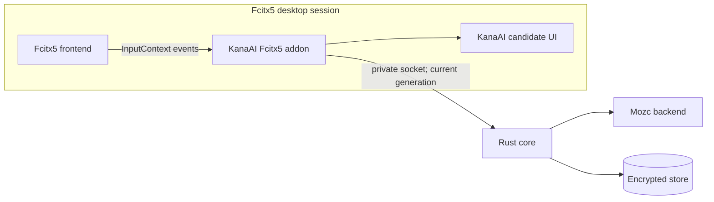
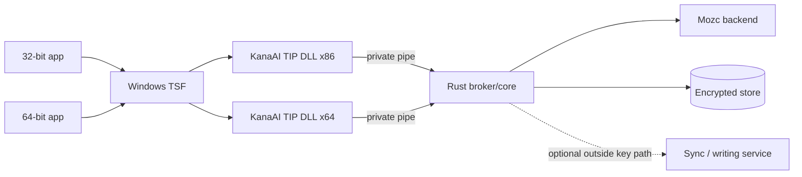
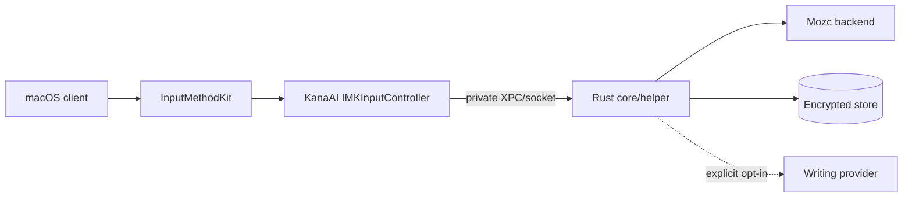

# KanaAI platform roadmap

**Status:** proposed delivery plan, not a shipped-release schedule
**Research access date:** 2026-09-24

KanaAI will ship one conversion/policy core in Rust and thin native input-method shells. The order is deliberately **Linux/Fcitx5 first, Windows/TSF second, macOS/InputMethodKit third**.

## Principles

- **Prove the core on Linux before multiplying ABI surfaces.**
- **Never put network, learning, or generative AI on the synchronous input path.**
- **Treat accessibility, focus, preedit, secure input, and process recovery as core IME behavior.**
- **Sign and update every native distribution; trust warnings are a distribution problem, not something to hide.**
- **Use TypeScript only in the development lab.**
- **Ship no platform until the privacy, licensing, conformance, and crash-recovery gates pass.**

## Current baseline

The repository contains a pinned Mozc source submodule, Rust core/API, a source-buildable Mozc bridge, and a TypeScript workbench. The native platform shells are still a target. No document here claims that an Fcitx5 addon, TSF DLL, InputMethodKit bundle, installer, sync service, or production writing assistant currently exists.

## Target platform order

Relative milestones may overlap only after the prior milestone's exit criteria are met. The schedule does not promise calendar dates.

## Responsibility matrix

| Capability | Linux/Fcitx5 | Windows/TSF | macOS/InputMethodKit |
|---|---|---|---|
| OS event integration | Fcitx5 frontend/input context | TSF TIP COM DLL | `IMKServer` / `IMKInputController` |
| Native shell | Small C++ addon | Small C++/COM DLL | Small Objective-C++ controller/app |
| Session/ranking/learning/policy | Shared Rust core | Shared Rust core | Shared Rust core |
| Conversion | Pinned Mozc backend | Pinned Mozc backend | Pinned Mozc backend |
| Candidate UI | Fcitx5-compatible native UI | TSF owned window/UI element | InputMethodKit candidate UI |
| Core-process transport | Private Unix-domain socket | Private named pipe/socket | Private XPC or Unix-domain socket |
| Optional network | Rust core, outside input process where needed | Rust broker process | Rust helper/service |
| Package | Distro package plus portable developer bundle | Signed MSI/MSIX and optional EXE bootstrap | Signed/notarized PKG and input-method app |
| First architecture | x86_64 Linux, then arm64 | x86/x64 compatibility; ARM64 later | Universal x86_64 + arm64 |

## Phase 0 — Foundation and conversion spike

### Deliverables

- A versioned shell-to-Rust protocol and deterministic session state machine.
- A Rust `ConversionProvider` trait and pinned Mozc external-server adapter.
- Golden preedit/conversion/commit fixtures.
- A lab-only TypeScript client that drives synthetic requests through the Rust lab API.
- A content-free local diagnostic trace.
- A dependency/SBOM and third-party notice pipeline covering Mozc code, dictionary data, generated data, and every packaged dependency.

### Exit gates

- No TypeScript code in a native package.
- No dual persistent learning source.
- Process restart never duplicates or loses an acknowledged commit.
- All network/AI interfaces are disabled in default builds.
- Licensing review accepts a multi-license package expression, not “BSD-3-Clause only.”
- Release-mode p95 budgets in [ARCHITECTURE.md](ARCHITECTURE.md) are measured or have an approved fallback design.

## Phase 1 — Linux/Fcitx5 first

Fcitx5 is the first native target because its extensible framework/addon model provides a direct way to test the Rust core before adding COM or InputMethodKit. Fcitx5's developer guide describes an input-method add-on as a shared library implementing `InputMethodEngineV2`, with per-input-context state and candidate/preedit integration ([Fcitx5 developer guide](https://fcitx-im.org/wiki/Develop_an_simple_input_method), accessed 2026-09-24).

### Native shape

The addon is not allowed to duplicate conversion logic. It may:

- receive normalized key events and edit callbacks;
- maintain only native handles/Fcitx properties for the current input context;
- translate KanaAI `Preedit`, candidate page, and commit events to Fcitx APIs;
- call Rust synchronously only within the local key deadline; and
- reconnect/recreate a context through a documented shell message.

It may not read user dictionaries, rank candidates, contact a service, or retain a composition after Fcitx destroys the context.

### Linux packaging

The release should provide, at minimum:

- addon and input-method registration metadata in Fcitx5's expected data directories;
- the Rust core, Mozc backend, and reviewed dictionaries installed under a KanaAI-owned prefix;
- an unprivileged session service autostart, with a 64-bit and ARM64 build where dependencies permit;
- distro packages for the supported distributions plus a documented developer bundle; and
- uninstall that removes service state only after an explicit user choice to retain learned data.

The exact distribution matrix is a release decision, not assumed by this document. Package scripts must never run conversion as root.

### X11 and Wayland test matrix

Fcitx5 supports X11 and Wayland, but applications and compositors use different paths. Fcitx's current guidance says modern GTK applications can use Wayland `text-input-v3`, X11/XWayland still needs `XMODIFIERS=@im=fcitx`, and Qt behavior depends on Qt version/compositor. Native Wayland input can also present per-window context limitations and popup-position issues ([Fcitx5 Wayland guide](https://fcitx-im.org/wiki/Using_Fcitx_5_on_Wayland), accessed 2026-09-24).

Linux beta must test at least:

- native GTK and Qt applications;
- X11/XWayland and native Wayland clients;
- a Wayland compositor with a supported input-method protocol;
- SDL/terminal/editor/browser families;
- focus loss, candidate-window movement, virtual keyboard overlap, and per-monitor scaling;
- password/secure fields and screen sharing; and
- compositor restart, Fcitx restart, Rust crash, and Mozc crash.

### Linux exit gates

- Correct preedit, segment selection, first-segment/full commit, undo, and focus teardown across the test matrix.
- No stale popup or cross-application candidate after context destruction.
- Optional learning is absent from password/protected contexts and survives restart correctly.
- x86_64 release package passes reproducible-build and notice checks.
- Accessibility can reach candidates and state without keyboard trapping.
- Offline conversion and learning meet release latency budgets.

## Phase 2 — Windows/TSF

Microsoft requires custom IMEs to use Text Services Framework (TSF); IMM32-only implementations are blocked. TSF loads the selected IME DLL into the application's process and applies that process's app-container restrictions. A DLL cannot assume Internet access or unrestricted filesystem access ([Microsoft IME requirements](https://learn.microsoft.com/en-us/windows/apps/develop/input/input-method-editor-requirements), accessed 2026-09-24).

### Native shape

The TIP DLL is intentionally thin. It implements required COM/TSF objects, translates key/edit/commit callbacks, presents the owned candidate window, and forwards normalized commands to the Rust broker. Network, long dictionary work, sync, and generative requests are broker work and never occur implicitly in the loaded DLL.

### Current Windows beta boundary

Before the TSF pilot is complete, KanaAI will publish a portable Windows beta
containing the Rust API, the pinned Mozc bridge, and the local browser
workbench. It is installable and usable through PowerShell, but it is not yet a
registered system IME. The package must show this boundary in its first-run
screen and release notes. The TSF TIP, x86/x64 registration, candidate window,
and secure-field behavior remain native beta exit gates. Build and per-user
install instructions are in [`WINDOWS_BETA.md`](./WINDOWS_BETA.md).

- TSF text-service and input-processor-profile registration.
- Side-by-side 32-bit and 64-bit DLLs. Microsoft states DLLs are bit-specific and recommends parallel x86/x64 DLLs with the same file name so 64-bit Windows exposes one logical IME ([Microsoft 64-bit TSF guidance](https://learn.microsoft.com/en-us/windows/win32/tsf/64-bit-platform-considerations), accessed 2026-09-24).
- Correct Program Files/Program Files (x86) and registry views for text-service files.
- App-container-safe read-only data locations and explicit ACLs where required.
- Candidate UI as an owned window with light-dismiss WinEvents, DPI behavior, and no sticky/full-screen window.
- UI Automation candidate/prediction IDs and selection events.
- Secure desktop/UAC, password fields, touch keyboard, and per-app container tests.
- A separate broker for updates and optional network where app-container policy makes the DLL path unsuitable.
- 64-bit installer architecture and x86/x64 file redirection tests.

ARM64 is a later compatibility target, not part of the initial Windows beta. An ARM64 TIP may be added only with matching registration/install tests; it does not replace the x86/x64 pair.

### Installer, signing, and SmartScreen

KanaAI will use a signed MSI/MSIX where possible and may use a conventional bootstrap executable for distribution compatibility.

**Distribution documentation must not claim that `setup.exe` bypasses Microsoft Defender SmartScreen.** Microsoft states that SmartScreen considers publisher/file reputation and that even a validly signed first download can show an “unrecognized” warning until reputation accumulates; EV certificates no longer bypass it. A self-signed/unsigned build is not suitable for public distribution ([Microsoft SmartScreen reputation](https://learn.microsoft.com/en-us/windows/apps/package-and-deploy/smartscreen-reputation) and [code-signing options](https://learn.microsoft.com/en-us/windows/apps/package-and-deploy/code-signing-options), both accessed 2026-09-24).

Release requirements:

- sign every installer and executable after final packaging;
- use a stable, trusted publisher identity and timestamp releases;
- publish checksums through an authenticated release channel;
- tell beta users to verify the publisher and expect a first-download warning;
- never instruct users to disable SmartScreen, Smart App Control, antivirus, or enterprise policy; and
- submit suspected false detections through Microsoft's security process without claiming instant reputation repair.

### Windows exit gates

- The same logical IME loads correctly in x86 and x64 applications.
- No silent architecture mismatch.
- TSF/UIA candidate semantics, preedit, cancellation, and focus teardown pass in desktop and app-container applications.
- Rust/Mozc restart does not duplicate a commit.
- Installer upgrade/downgrade/repair/uninstall preserves or deletes user data according to an explicit choice.
- A production-signing rehearsal and Microsoft distribution review are complete.

## Phase 3 — macOS/InputMethodKit

InputMethodKit provides `IMKServer`, and an `IMKInputController` instance corresponds to each client input session. The input method's main function creates the server, which Apple documents as the normal entry point ([Apple `IMKServer`](https://developer.apple.com/documentation/inputmethodkit/imkserver) and [`IMKInputController`](https://developer.apple.com/documentation/inputmethodkit/imkinputcontroller), accessed 2026-09-24).

### Native shape

The Objective-C++ shell creates `IMKServer`, handles the required lifecycle, and creates one controller per input session. It translates events and preedit/selection ranges, presents candidate UI, and routes to Rust. It contains no Japanese conversion, ranking, learning, persistence, or HTTP code.

### Required macOS work

- Input-method app bundle and `Info.plist` metadata.
- Installation in the supported input-method location and registration in System Settings.
- `IMKServer` plus per-client `IMKInputController` lifecycle.
- Japanese/ASCII keyboard mode, physical-key handling, and IME-on/off behavior.
- Candidate placement, focus loss, secure input, lock screen, accessibility, and multiple spaces.
- Universal x86_64/arm64 shell and helper; Mozc architecture support is tested separately.
- Developer ID signing, hardened runtime where required, notarization, and stapling.
- Crash-safe helper lifecycle and no network access from the input event callback.

Apple requires Developer ID signing for notarization and explains notarization as the Gatekeeper review workflow for distributed software ([Apple notarization](https://developer.apple.com/documentation/security/notarizing-macos-software-before-distribution) and [hardened runtime](https://developer.apple.com/documentation/security/hardened-runtime), accessed 2026-09-24).

### macOS exit gates

- Controller state is one-to-one with client sessions and destroyed on focus loss.
- Preedit, candidate selection, secure input, and commit pass across system and third-party apps.
- The app/helper is signed, notarized, hardened, and launches from a clean user account.
- Universal binaries and Mozc data pass integrity and licensing checks.
- No assistant, sync, or cloud operation occurs without an explicit action.

## Rust as the shared native-adapter layer

The shared Rust core exposes the same versioned commands to all native shells. Platform differences stop at L1 in [ARCHITECTURE.md](ARCHITECTURE.md):

- Fcitx5 sends a normalized `InputMethodEngineV2` event.
- TSF sends a key/edit context after COM translation.
- InputMethodKit sends an event after `NSEvent` translation.

From L2 onward, all platforms use the same `Key`, `Edit`, `Candidate`, `Commit`, privacy, learning, and error DTOs. Platform-specific behavior belongs in explicit capability negotiation, not forked business logic.

TypeScript is used only by the lab to visualize these same DTOs. It never becomes the cross-platform native abstraction because browser/Node lifecycle and security models do not match any of the three native input contracts.

## Cross-platform release gates

Every public release, on every platform, must satisfy:

### Conversion and state

- pinned Mozc conversion conformance and data-version report;
- deterministic user/domain ranking and no display-only learning;
- undo/delete/sync reconciliation;
- malformed input and process-kill recovery;
- golden Unicode text and offset tests; and
- no regression in committed text even if candidate metadata changes.

### Performance

- release-mode p50/p95/p99 for key, preedit, conversion, commit, startup, and memory;
- results for cold/warm data and low-power mode;
- no network or full migration on the key path;
- bounded CPU after focus loss/idle; and
- no unbounded queue/cache growth.

### Privacy/security

- canary content absent from logs, metrics, crash reports, update metadata, and network;
- password/protected/Protect Mode behavior by platform;
- OS key-store integration and deletion tests;
- private transport authentication and peer validation;
- signed update artifacts/rollback;
- dependency, SBOM, license, and notice review; and
- explicit cloud/AI/sync payload previews.

### Native UX and accessibility

- preedit, candidate, commit, cancel, and focus behavior match the shared state model;
- keyboard-only and pointer selection;
- platform accessibility APIs expose correct names, selection, and state;
- high DPI, multiple monitors/workspaces, dark/light system appearance, and long candidates;
- localized errors without technical text leakage; and
- clear recovery when the core or conversion provider is unavailable.

## Release channels

| Channel | Purpose | Data/network rule |
|---|---|---|
| Developer lab | Synthetic fixtures and explicit local test data; TypeScript allowed. | No production profile/credentials. |
| Internal alpha | Linux native shell, crash diagnostics, opt-in local profile. | Telemetry off; manual export. |
| Windows portable beta | Per-user Workbench/CLI package; no TSF registration | No model or network by default; unsigned warning visible |
| Public beta | Signed native package, support workflow, transparent notices. | Cloud/AI/sync individually opt-in. |
| Stable | Reviewed release, staged update/rollback, published hashes/SBOM. | Local conversion always available. |
| Enterprise (future) | Managed policies and organization domain packs. | Separate policy/admin design; not implied by the first release. |

## Non-goals for the initial desktop roadmap

- Android or iOS keyboards.
- Fcitx4 or IBus as a primary target.
- Replacing Fcitx5, TSF, or InputMethodKit with a custom global key hook.
- Shipping a Windows ARM64 TIP before x86/x64 compatibility is proven.
- Hosted conversion, mandatory telemetry, or ad-based personalization.
- A mobile-style AI keyboard before desktop privacy and recovery controls are stable.
- Attempts to reproduce ATOK or Google Japanese Input proprietary internals.

## Primary platform sources

All sources were accessed **2026-09-24**.

1. [Fcitx5 repository and supported X11/Wayland scope](https://github.com/fcitx/fcitx5)
2. [Fcitx5 input-method developer guide](https://fcitx-im.org/wiki/Develop_an_simple_input_method)
3. [Fcitx5 Wayland guidance](https://fcitx-im.org/wiki/Using_Fcitx_5_on_Wayland)
4. [Microsoft Text Services Framework](https://learn.microsoft.com/en-us/windows/win32/tsf/text-services-framework)
5. [Microsoft custom IME requirements](https://learn.microsoft.com/en-us/windows/apps/develop/input/input-method-editor-requirements)
6. [Microsoft 64-bit TSF guidance](https://learn.microsoft.com/en-us/windows/win32/tsf/64-bit-platform-considerations)
7. [Microsoft SmartScreen reputation](https://learn.microsoft.com/en-us/windows/apps/package-and-deploy/smartscreen-reputation)
8. [Microsoft code-signing options](https://learn.microsoft.com/en-us/windows/apps/package-and-deploy/code-signing-options)
9. [Apple InputMethodKit](https://developer.apple.com/documentation/inputmethodkit)
10. [Apple `IMKServer`](https://developer.apple.com/documentation/inputmethodkit/imkserver)
11. [Apple `IMKInputController`](https://developer.apple.com/documentation/inputmethodkit/imkinputcontroller)
12. [Apple notarization](https://developer.apple.com/documentation/security/notarizing-macos-software-before-distribution)
13. [Apple hardened runtime](https://developer.apple.com/documentation/security/hardened-runtime)
