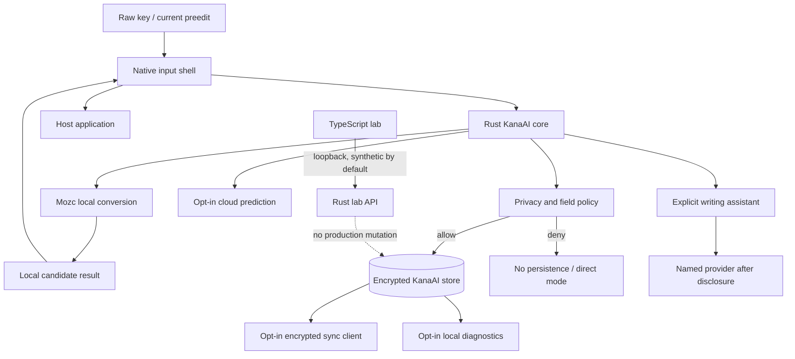

# KanaAI privacy and data-protection design

**Status:** target-product privacy requirements; not a current deployed-service notice
**Research access date:** 2026-09-24

KanaAI is designed local-first because an input method sees text before the user necessarily wants it stored, predicted, or transmitted. This document is the engineering privacy contract. Before any public release, the operator must also publish a release-specific legal privacy notice naming the controller/operator, contact, jurisdictions, subprocessors, and actual service configuration. This design document does not invent those details and is not legal advice.

## Non-negotiable defaults

1. **Composition and conversion work without an account or network.**
2. **The current preedit, raw key stream, clipboard, and full document text stay in memory and are not persisted by default.**
3. **Learning is local, inspectable, reversible, and disabled for password/protected fields.**
4. **Cloud prediction, sync, diagnostics, and generative writing each require separate opt-in.**
5. **Generative AI is user-invoked, cancellable, previewed, and never a conversion dependency.**
6. **No input content is sold, used for advertising, or included in telemetry by default.**
7. **Deletion in KanaAI is real deletion, not merely a hidden UI filter.**
8. **A missing key store, revoked network, unavailable provider, or disabled sync never causes plaintext fallback.**
9. **TypeScript is development-only and cannot read live system input or production profile data by default.**

## Trust boundaries and data flow



The native shell forwards only the current native key/edit event and minimal field metadata. Raw document selection, clipboard, window title, URL, and filesystem path are not part of the normal shell protocol.

## Threat model

| Threat | Required controls | Residual risk |
|---|---|---|
| KanaAI accidentally logs or sends typed content | Canary tests, typed redaction boundary, no content metrics, packet capture, reviewable egress client. | A bug can still leak; reporting/update process is required. |
| Another local process reads learning data | User-only permissions, authenticated encryption, OS key store, peer-authenticated local IPC. | A compromised same-user process or OS can still capture input. |
| Cloud prediction sees sensitive reading prefixes | Separate opt-in, minimal prefix-only payload, visible request preview, no document context, disable/kill switch. | Prefixes can be sensitive; the feature is off by default. |
| Sync server reads personal dictionaries | Client-side encryption before transport, recovery-key design, metadata-minimized protocol. | Account/device metadata and traffic timing remain visible; key loss loses synced data. |
| AI provider retains or trains on text | Explicit provider/region/retention disclosure, no background sends, optional provider account, no KanaAI history attached. | KanaAI cannot independently control a third party's retention or training unless its terms/contracts guarantee it. |
| Mozc creates a second unprotected history | Isolated profile, native persistent history disabled or non-canonical, projected store, deletion/rebuild tests. | Upstream data behavior changes require an update review. |
| Platform/OS collects input | Respect secure-input contracts; document OS-level limits; do not attempt to bypass app containers or security. | The host OS and already-trusted input path remain outside KanaAI's control. |
| Update/supply-chain compromise | Signed artifacts, pinned dependencies, SBOM, reproducible provenance, staged rollout/rollback. | A validly signed update can still carry malicious code; review and response are required. |
| User mistakes and over-personalization | Per-profile controls, bounded ranking, visible sources in diagnostics, undo/delete. | Conversion can still be wrong; KanaAI does not claim linguistic correctness. |

## Data classification

| Class | Examples | Default handling |
|---|---|---|
| **C0 — ephemeral content** | raw keys, preedit, current candidates, correction text, selected text, instructions | Memory only; shortest lifetime; no logs. |
| **C1 — personal language data** | readings/surfaces, learning counters, history, user/domain entries, short commit records | Local encrypted persistence only after policy check; export/delete controls. |
| **C2 — sensitive operational metadata** | coarse app class, profile ID, sync timestamps, device ID, model/provider ID | Local or minimized when opted in; separate from C0/C1. |
| **C3 — service/security metadata** | version, OS/architecture, feature flags, duration buckets, error codes, signed update identity | Minimal local logs; remote only through the applicable opt-in/policy. |
| **C4 — secrets** | encryption keys, recovery key, auth tokens, provider credentials | OS credential store where available; never in profile export/logs. |

Raw C0 content is never promoted to C1 because it was shown, requested, or converted. Promotion requires an explicit product operation such as a confirmed learning event, user registration, enabled short history, or user-invoked writing request.

## Data inventory and retention

| Data | Why needed | Default | Storage/destination | Retention target |
|---|---|---|---|---|
| Raw key events | Compose current input | On while composing | Process memory | Erased/zeroized on commit, cancel, focus loss, timeout, or crash cleanup. |
| Current preedit and candidates | Show/convert input | On | Process memory; optional in-memory redaction trace only in lab | Current session/generation. |
| Surrounding document text | Possible disambiguation | **Off** | Never sent by default | If a future bounded-context option is enabled: current request plus at most 32 Unicode scalars total, no newline, explicit scope. |
| Confirmed reading/surface learning | Personalize future conversion | On only if learning is enabled | Authenticated local store | Until user deletion/profile reset; unmerged events merge or expire after 30 days. |
| User-registered entries | User intent | On when explicitly registered | Authenticated local store | Until deleted. |
| Domain-pack settings | Select licensed terminology | Off until pack explicitly enabled | Local store | Until pack removed. |
| Full/short commit history | Next-input prediction/repeat | **Off** | Authenticated local store only when enabled | Default when enabled: 30 days; user may set shorter or indefinite local retention. |
| App rules | Per-app learning/packs | Off; user-created coarse class | Local store | Until deleted. |
| Candidate source/rank diagnostics | Explain ranking | Local summary | Redacted local diagnostics | 30 days by default; content disabled. |
| Crash report | Diagnose native failure | Off/opt-in after review | Redacted local file; remote only if approved | Local 30 days; remote maximum 90 days unless consent says otherwise. |
| Performance telemetry | Capacity/regressions | Off in stable by default | No raw text; buckets/counters only | If enabled: 30 days aggregated; longer only in a documented, reviewed aggregate. |
| Cloud prediction request | Improve a user-requested result | Off | HTTPS to named provider | Memory locally; remote retention is provider-specific and disclosed. Requests are not background training data for KanaAI. |
| Sync record | Multi-device state | Off | Client-encrypted before transport | Until user deletion; deleted/tombstoned data purged from active storage within 35 days, subject to the narrower launch policy. |
| Writing request/result | User-requested generation | Off until invoked | Memory by default; provider disclosure | KanaAI does not retain a result history by default; provider retention follows the displayed terms. |
| Account identifier | Authenticate optional sync/services | No account for local use | Service and local OS credential | Until account deletion; deletion request target 30 days. |
| Recovery key | Restore end-to-end encrypted sync | Only if sync is enabled | User holds it; KanaAI does not store a plaintext copy | Until user rotates/revokes it. |

These are design targets. A feature is not production-ready until its measured implementation, backup behavior, and subprocessors match this table.

## Local learning policy

### Allowed learning event

A learning event may be created only after a **confirmed local commit** or an explicit user action. It contains only the minimum semantic data:

- reading and committed surface (or a reference to a confirmed local record);
- candidate source;
- bounded weight delta and aggregate counts;
- coarse app class if the user enabled that profile;
- enabled domain-pack IDs, not their full contents;
- timestamp/session metadata; and
- causal/compensating IDs for undo and deletion.

It must not contain a window title, document path, URL, full paragraph, clipboard, app-reported surrounding text, or raw keystrokes.

### Prohibited learning

No learning, history, suggestion, correction, cloud, sync, or AI request is allowed for:

- password/secret fields;
- explicit no-learning fields;
- Protect Mode sessions;
- a profile with learning globally disabled;
- candidates merely displayed, hovered, paged past, or rejected by a stale request; or
- text sent only to the TypeScript lab.

### Ranking bounds

User/domain/history/cloud contributions are policy features, not unconstrained model updates. Every contribution has a configured maximum. A domain pack cannot promote a candidate across a field restriction, and cloud results cannot overwrite local state. These limits reduce accidental feedback loops and make learning auditable.

## Document context and application identity

### Default request

The default conversion request contains:

- current key/composition state;
- input mode and locale;
- field class (`normal`, `no-learning`, `password`, `protected`);
- KanaAI protocol/profile version; and
- locally chosen dictionary-pack identifiers.

It contains no document context.

### Optional bounded context

A future “use nearby text” setting must be separate from learning and cloud controls. At launch, if enabled, it may include only a maximum of 32 Unicode scalars immediately around the composition, with no newline, and must expire after the generation. A preview/counter must show that context was used. The first implementation should omit this feature if the platform cannot prove a bounded read.

### Application rules

A user assigns an app to a coarse local class such as “work chat,” “code,” or “personal.” KanaAI should use a platform identifier only long enough to derive that class, then discard the raw identifier. It must not collect executable paths, document names, window titles, URLs, or browsing history by default.

The Fcitx5 Wayland guidance notes that some input protocols expose a more global input context, which makes per-window identity less precise. KanaAI must reflect that uncertainty rather than pretending a global context is a trustworthy app identity ([Fcitx5 Wayland guidance](https://fcitx-im.org/wiki/Using_Fcitx_5_on_Wayland), accessed 2026-09-24).

## Protect Mode and secure fields

Protect Mode is an explicit local state with these semantics:

- suspend persistent learning and history;
- cancel outstanding sync, cloud prediction, diagnostics, and writing work;
- do not send context or app identity;
- suppress prediction/preview surfaces according to the platform's safe-input capability;
- avoid leaking candidate text in notifications, task switchers, logs, or accessibility labels; and
- show a clear indicator that personalization is inactive.

A password/secure field is stronger: it bypasses optional ranking features and does not create a cloud or sync job. Windows TSF documentation notes that an IME is loaded inside the application process and constrained by that process's app-container rules; KanaAI must respect those constraints rather than attempting to bypass them ([Microsoft IME requirements](https://learn.microsoft.com/en-us/windows/apps/develop/input/input-method-editor-requirements), accessed 2026-09-24).

## Mozc data boundary

Mozc's upstream data-protection design says most local data is stored in plain text and that selected data is obfuscated with AES-256 CBC for casual-leak protection; it also says Linux stores the key/salt as plain data and warns that the implementation is not verified for security-critical use ([Mozc data-protection design](https://github.com/google/mozc/blob/master/docs/design_doc/data_protection.md), accessed 2026-09-24).

KanaAI therefore:

- does not treat Mozc's upstream history as its encrypted canonical store;
- uses an isolated KanaAI Mozc profile;
- disables/discards non-canonical native persistent history where possible;
- encrypts its canonical records with an OS-key-backed authenticated design;
- verifies no duplicate native history after restart/delete tests; and
- does not call upstream “obfuscation” end-to-end encryption.

The exact KanaAI AEAD and key derivation must be selected, reviewed, and documented before release. The architecture forbids reusing Mozc's unverified primitives as KanaAI's security boundary.

## Network policy

### Always-local operations

These never require a network and are not contingent on account status:

- composition and conversion;
- kana/ASCII mode changes;
- local candidate ranking;
- local user/domain dictionaries;
- local learning/history when enabled;
- correction and candidate explanation;
- profile export/import; and
- deletion of local data.

### Separate opt-in network features

| Feature | Minimum request | Prohibited additions | User control |
|---|---|---|---|
| Update check | app version, platform/architecture, release channel; signed response verification | composition, app identity, dictionary words, profile ID | disable; updates can be manual. |
| Cloud prediction | explicit opt-in, current normalized prefix, locale, dictionary version, coarse pack IDs, request ID | document context, commit history, app identity, raw keys, user dictionary | per-profile toggle, preview, pause now, disable. |
| Sync | encrypted record/tombstone, entity ID/type, device ID, logical clock, size | plaintext readings/surfaces, document text, provider prompts | per-category toggle, device list, export, delete, revoke devices. |
| Diagnostics | release/OS/arch, feature flags, duration/count buckets, redacted error code | C0/C1 content, candidate text, file paths, window titles, URLs | explicit opt-in with payload preview. |
| Generative writing | named provider, selected text, user instruction, purpose, disclosure version | history, user dictionary, app identity, surrounding document, style corpus unless separately shown | invoke per request, cancel, disable, delete provider job. |

A timeout, provider error, certificate failure, account deletion, or network loss returns the user to local input. There is no hidden fallback that sends composition data elsewhere.

### Egress implementation rules

- Only the Rust optional-services layer may open network connections.
- Native shells and Mozc never receive network credentials.
- Production egress uses TLS, certificate validation, redirect restrictions, bounded response sizes, and request deadlines.
- URLs/hosts are allowlisted per feature; user-entered arbitrary URLs are not accepted in the IME process.
- Every request has a correlation ID that contains no content.
- Debug packet capture is a development-only build, redacts secrets/content, and cannot be enabled in stable.
- The lab UI can show the exact serialized/redacted request before a test send.

## Generative writing assistant

A writing request is a separate product operation, not an IME conversion feature.

Before the first send to a named provider, KanaAI must display:

1. provider identity and region/endpoint;
2. selected text or a clear description of what will be sent;
3. exact user instruction;
4. whether any local style summary or context is included;
5. provider retention/training terms or a clear “not verified” notice;
6. estimated size/limit and cancellation; and
7. whether the result may replace the current selection only after preview.

Default payload:

```text
selected_text + user_instruction + locale + purpose
```

Default exclusions:

```text
KanaAI learning history + user/domain dictionary + app identity
+ surrounding document + prompts from other requests
```

KanaAI must not call a provider when the field is password/protected or Protect Mode is active. A local model may be offered separately, but its model/data license and resource behavior must be disclosed; local does not automatically mean private if it downloads or updates content silently.

ATOK's public MiRA pages show a useful UX pattern—in-place/selected rewrite, presets, and explicit apply—but public ATOK sources do not establish a MiRA model/provider or detailed payload/retention contract. KanaAI must not represent its behavior as ATOK's undisclosed internals ([ATOK 2026 features](https://atok.com/features/), accessed 2026-09-24).

## Sync and multi-device state

Sync is opt-in and independently revocable. KanaAI syncs semantic records, not raw database files or a full home-directory copy.

### Client-side encryption

- Generate a random sync data-encryption key on a user device.
- Encrypt each record with authenticated encryption and a unique nonce before transport.
- Wrap the data key with a user recovery key and/or approved device keys.
- Never put the plaintext data key, recovery key, or auth token in sync payloads/logs.
- Require a new nonce/key generation after recovery-key rotation.
- Losing all keys means losing encrypted sync data; KanaAI must not provide a weak server-side “forgot key” recovery.

### Visible sync categories

Users can independently enable or disable:

- user entries;
- learning aggregates;
- optional short history;
- domain-pack selections (package content downloads separately);
- app rules; and
- non-sensitive settings.

A semantic conflict creates two versions for user review. Deletion uses a tombstone so a deleted entry is not resurrected by an older device. The server should minimize visible metadata to account, opaque device ID, entity type/size, logical time, and delivery state.

## Local storage security

### Required properties

- User-only directory/file permissions on every supported platform.
- Authenticated encryption for C1 and sync payloads; integrity failure fails closed.
- Keys/tokens in the platform credential store where available.
- No master key shared across users/devices.
- No plaintext fallback if key storage fails.
- Secure deletion semantics: remove keys/records and request secure deletion where the filesystem/provider supports it; document that SSD/backup deletion cannot always guarantee physical erasure.
- Schema migrations that preserve or explicitly transform user data, with a rollback/export path.
- Crash reports compiled with content capture disabled and tested for canary strings.

### Key loss and account loss

- Local key loss: local profile becomes unreadable; export/reset is explicit, never automatic plaintext recovery.
- Sync recovery-key loss: encrypted remote records are unrecoverable unless another approved device/key can rewrap them.
- Account deletion: revoke tokens/devices, stop sync, apply the published deletion schedule, and provide a confirmation/export window.

## Telemetry and diagnostics

### Always-safe local measurements

Local metrics may include:

- duration buckets;
- counts of key, conversion, candidate, commit, timeout, and restart events;
- memory/cache high-water buckets;
- version, architecture, feature flags, and redacted error codes.

They must not include reading, surface, candidate text, document context, app title/path, URL, keystroke sequence, or provider payload.

### Remote diagnostics

Remote diagnostics are off by default. If enabled, the UI shows the exact schema and a content canary test. A release build strips verbose key/value traces. Error reports use a short retention period and an incident-specific legal/privacy review.

## User controls

The production settings UI must make these actions findable without hidden gestures:

- pause learning globally and per app class;
- clear learning aggregates;
- delete one entry, one app rule, one device, or the whole profile;
- disable short history;
- disable cloud prediction independently;
- inspect/revoke sync devices and rotate the recovery key;
- disable diagnostics;
- disable the writing assistant and clear its local job history;
- export a versioned archive and preview what it contains; and
- activate Protect Mode and see which features it suspends.

Changing a privacy decision takes effect for new work immediately and cancels matching in-flight jobs. The UI distinguishes “stop future collection” from “delete data already collected”; controls that only pause are not labeled delete.

## Data export, deletion, and account lifecycle

### Export

An export contains a machine-readable manifest, schema version, settings, user/domain entries, learning aggregates, and optional history selected by the user. It excludes OS secrets, auth tokens, encryption keys, and hidden raw-key logs. The UI previews counts and fields before writing the archive.

### Local deletion

- **Entry delete:** remove/encrypt out the entry and create a tombstone if sync is enabled.
- **History clear:** remove history and derived recency features; preserve only an explicitly retained user entry.
- **Learning reset:** remove aggregates/queues and rebuild/refresh the Mozc projection.
- **Profile reset:** stop adapters, remove all profile data, clear key handles, and return to direct/local mode.
- **Uninstall:** ask separately whether to retain the KanaAI profile; default to retaining it only when uninstall is initiated by an update, not by explicit removal.

### Remote deletion

Sync deletion is acknowledged per device, propagated to active devices, and reflected in the UI. Backup/crypto-shredding behavior and the maximum purge window are stated in the release privacy notice. A support operator cannot view plaintext C1 data through the sync UI.

## Lab and developer privacy

The TypeScript lab:

- runs on loopback and is not installed by native packages;
- uses synthetic fixtures by default;
- requires a separate development profile for real data;
- cannot access unrestricted OS key events;
- cannot opt into production sync/AI credentials through a production build;
- redacts canary strings in request logs; and
- is excluded from signed end-user artifacts.

A developer build may enable verbose traces only with a visible banner and an expiring local file. Stable builds must not contain the switch or the raw logging sink.

## Security response and release checklist

### Before enabling any network feature

- threat model and data-flow review;
- provider/subprocessor and region disclosure;
- exact payload schema and minimization test;
- credentials isolated from the IME process;
- egress allowlist, TLS/redirect/size/deadline tests;
- user opt-in, pause, cancel, and delete paths;
- abuse/rate limits and account recovery; and
- independent security review proportionate to the data.

### Before every release

- canary strings absent from binaries, logs, metrics, crash dumps, sync, DNS, and packets;
- no raw key/preedit field in debug formatting;
- profile deletion and sync tombstone tests pass;
- key-store failure fails closed;
- password/secure/Protect Mode tests pass on all native adapters;
- signed artifacts and SBOM/notice review complete;
- dependency and license policy pass, including mixed Mozc dictionary terms;
- privacy notice matches actual behavior and subprocessors;
- incident owner, contact, and rollback process are published; and
- platform-specific input restrictions are respected.

Mozc's code license and dictionary terms are described in [MOZC_INTEGRATION.md](MOZC_INTEGRATION.md). Google-authored Mozc code is BSD-3-Clause, while dictionary data and third-party components are mixed; privacy/security packaging must preserve the complete notices rather than assuming one license.

## Primary sources

All sources were accessed **2026-09-24**.

1. [Mozc data-encryption and password-management design](https://github.com/google/mozc/blob/master/docs/design_doc/data_protection.md)
2. [Mozc license, including dictionary notices](https://github.com/google/mozc/blob/master/LICENSE)
3. [Mozc OSS dictionary terms](https://github.com/google/mozc/blob/master/src/data/dictionary_oss/README.txt)
4. [Microsoft custom IME/app-container requirements](https://learn.microsoft.com/en-us/windows/apps/develop/input/input-method-editor-requirements)
5. [Fcitx5 Wayland input-context guidance](https://fcitx-im.org/wiki/Using_Fcitx_5_on_Wayland)
6. [Apple InputMethodKit](https://developer.apple.com/documentation/inputmethodkit)
7. [ATOK 2026 MiRA public feature page](https://atok.com/features/)
8. [ATOK product-home privacy statement](https://atok.com/)
9. [ATOK Passport EULA](https://mypassport.atok.com/eula.html)
10. [JustSystems privacy policy](https://www.justsystems.com/jp/legal/privacy/)
